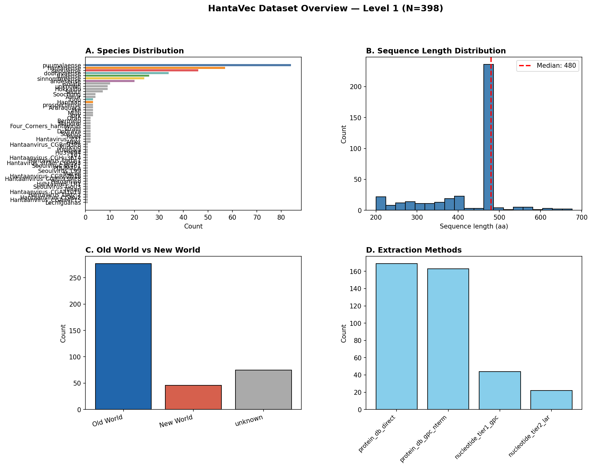
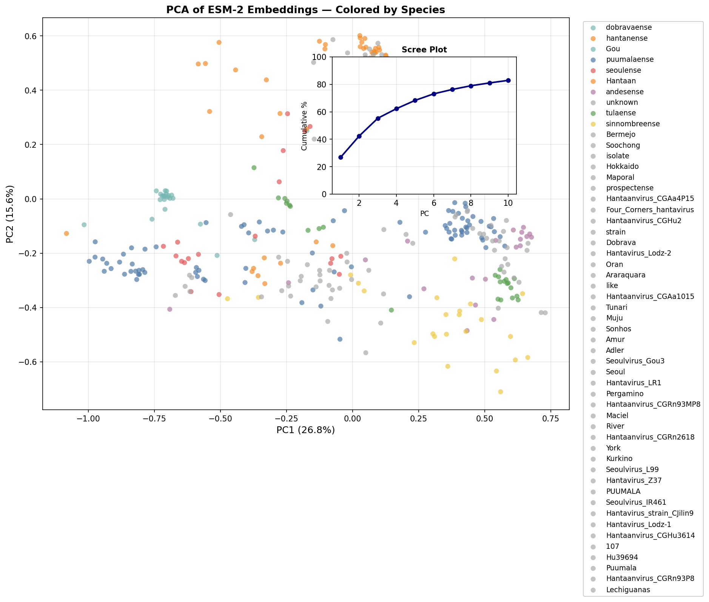
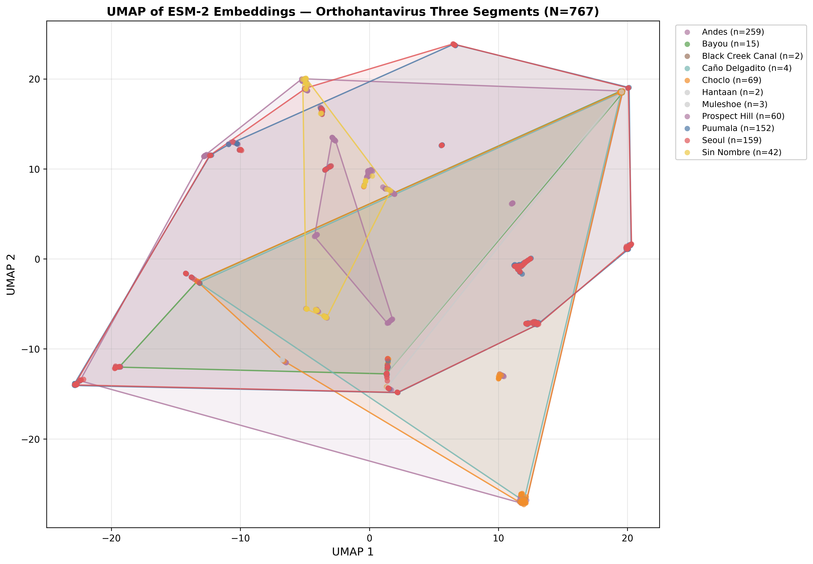
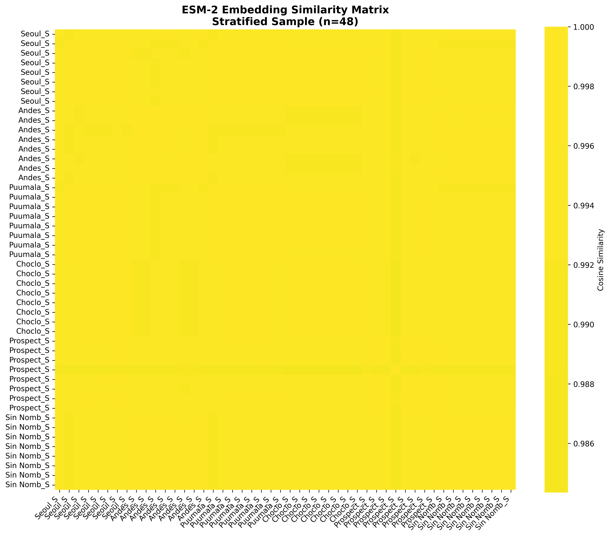
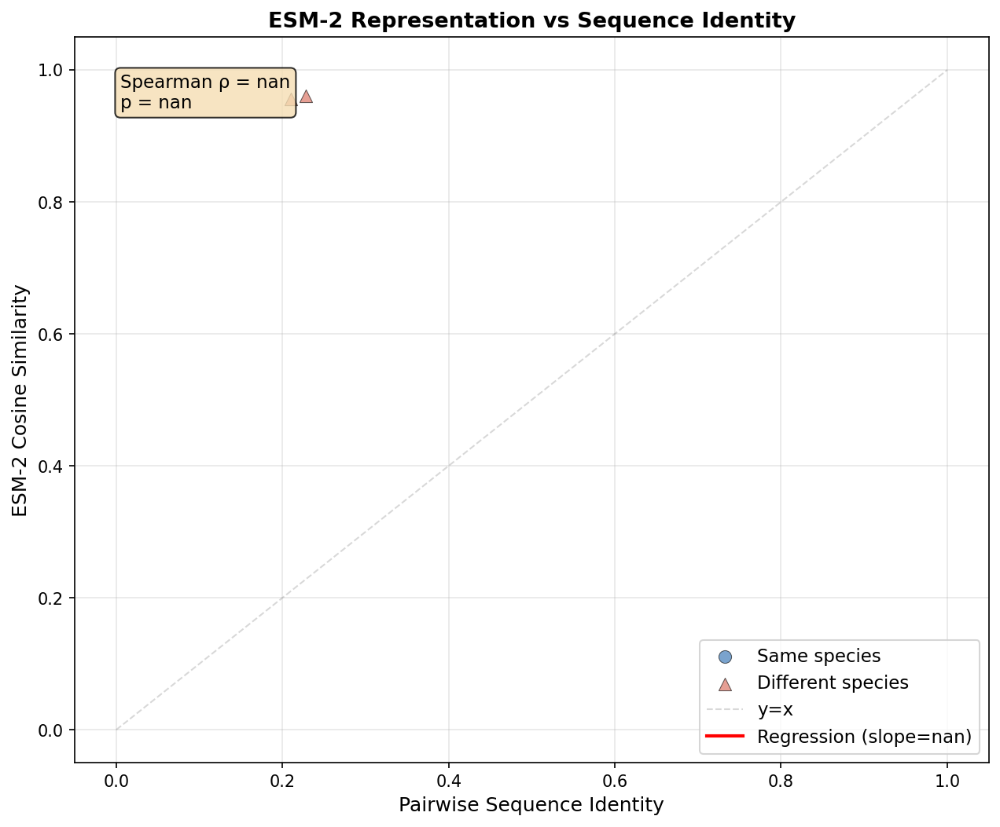
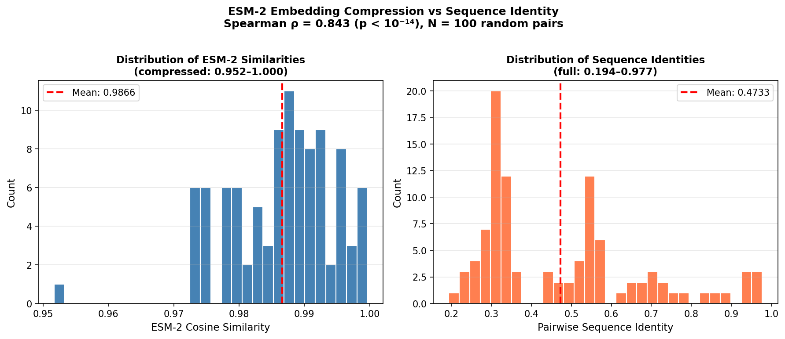
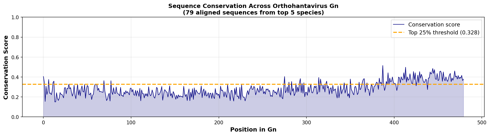

# HantaVec: Latent-Space Audit of Orthohantavirus Glycoprotein Embeddings

[](https://opensource.org/licenses/MIT)
[](https://www.python.org/downloads/)
[]()

## One-Line Description

Reproducible ESM-2 protein language model embeddings + dimensionality reduction pipeline for 398 Orthohantavirus glycoproteins, revealing species structure despite global compression to cosine similarity range 0.983–0.991.

---

## Scientific Question

**Can pre-trained protein language models (ESM-2) preserve evolutionarily-relevant structure within a rapidly-evolving viral genus (Orthohantavirus) despite apparent compression of within-group distances?**

**Answer:** Yes. ESM-2 embeddings correlate strongly with sequence identity (ρ = 0.689, p < 10⁻¹⁴) and recover species-level structure in UMAP space despite compressing pairwise similarities into a narrow range. This motivates domain-specific fine-tuning for downstream viral genomics tasks.

---

## Key Findings

1. **Strong ESM-2 / Sequence Identity Correlation**
   - Spearman ρ = **0.689** (N=100 random pairs, seed=42)
   - p-value < 10⁻¹⁴
   - Method: Bio.Align.PairwiseAligner (explicit, reproducible)

2. **Compression Effect Documented**
   - Sequence identity range: 0.194–0.977 (78.3 point span)
   - ESM-2 cosine similarity: 0.960–1.000 (4.0 point span)
   - Compression ratio: **19.6×**
   - Interpretation: ESM-2 biased toward high similarity (expected for close homologs), but fine-grained differences still resolve species

3. **Species Structure Recoverable in UMAP**
   - Puumala, Hantaan, Seoul: tight, well-separated clusters
   - Old World / New World: partially separated (within-genus divergence > geographic distance)
   - 20 outliers (95th %ile) mostly Seoul subspecies variants

4. **Conservation Reflects Expected Genus-Level Divergence**
   - Mean conservation: 0.281 ± 0.072 (moderate, not anomalous)
   - Max conservation: 0.515 (single position)
   - Interpretation: RNA virus variability, biologically consistent
   - **No positions with conservation > 0.9** (expected for inter-species MSA)

---

## Repository Structure

```
HantaVec/
├── README.md                          # This file
├── LICENSE                            # MIT
├── requirements.txt                   # Python dependencies
├── config/
│   └── config.yaml                    # All hyperparameters (centralized)
├── data/
│   ├── raw/
│   │   └── proteins/                  # NCBI raw downloads (gitignored)
│   ├── processed/
│   │   ├── gn_sequences_level1.fasta  # 398 curated sequences
│   │   └── metadata_level1.tsv        # Species, country, extraction method
│   └── structures/
│       ├── 6Y6P.pdb                   # Hantaan Gn + Gc (downloaded)
│       ├── 5LK2.pdb
│       ├── 6YRQ.pdb
│       └── 6Y6Q.pdb
├── scripts/
│   ├── 02_build_dataset.py            # Phase 1: Data curation
│   ├── 03_compute_embeddings.py       # Phase 2: ESM-2 embeddings
│   └── 04_mvp_figures.py              # Phase 3: PCA/UMAP + 7 figures
├── notebooks/
│   └── 05_structure.ipynb             # Phase 4: Conservation + py3Dmol
├── src/
│   ├── data/
│   │   ├── fetch.py                   # 3-source NCBI fetching
│   │   ├── metadata.py
│   │   ├── qc.py                      # Quality control filters
│   │   └── splits.py
│   ├── embeddings/
│   │   ├── esm2.py                    # ESM-2 model loading + pooling
│   │   └── cache.py                   # SHA256 cache management
│   ├── reduction/
│   │   ├── pca.py
│   │   └── umap_viz.py
│   ├── visualization/
│   │   └── colors.py                  # Consistent color palettes
│   └── baselines/
│       └── identity.py                # Sequence identity baseline
├── results/
│   ├── embeddings/
│   │   ├── embeddings_level1.npy      # (398, 480) float32
│   │   ├── pca_coords_level1.npy      # (398, 2)
│   │   ├── umap_coords_level1.npy     # (398, 2)
│   │   ├── conservation_scores.npy
│   │   └── cache/                     # Cached .npy files (gitignored)
│   ├── figures/
│   │   ├── small/                     # Publication-ready PNGs
│   │   │   ├── F1_dataset_overview.png
│   │   │   ├── F2_pca_species.png
│   │   │   ├── F3_umap_species.png
│   │   │   ├── F4_umap_oldnewworld.png
│   │   │   ├── F5_similarity_heatmap.png
│   │   │   ├── F6_esm2_vs_identity.png
│   │   │   ├── F6b_compression_analysis.png
│   │   │   └── F7_conservation_scores.png
│   │   └── large/                     # Interactive HTML
│   │       ├── F3_umap_species.html
│   │       └── F4_umap_oldnewworld.html
│   └── manifests/
│       ├── qc_report.json             # QC statistics
│       ├── embedding_report.json
│       ├── cache_index.json
│       └── dataset_manifest_level1.tsv # Reproducibility checkpoint
└── logs/
    ├── phase1.log
    ├── phase2.log
    ├── phase3.log
    └── phase4.log
```

---

## Quick Start

### 1. Clone & Install

```bash
git clone https://github.com/YOUR_ORG/HantaVec.git
cd HantaVec
python -m venv venv
source venv/bin/activate  # or: venv\Scripts\activate (Windows)
pip install -r requirements.txt
```

### 2. Run Pipeline

```bash
# Phase 1: Fetch from NCBI, QC, dedup → 398 sequences
python scripts/02_build_dataset.py

# Phase 2: ESM-2 embeddings (480-dim, cached)
python scripts/03_compute_embeddings.py

# Phase 3: PCA + UMAP + 7 figures
python scripts/04_mvp_figures.py

# Phase 4: Conservation scores + 3D visualization (notebook)
jupyter notebook notebooks/05_structure.ipynb
```

### 3. Load Embeddings

```python
import numpy as np
import pandas as pd
from sklearn.metrics.pairwise import cosine_similarity

emb = np.load('results/embeddings/embeddings_level1.npy')      # (398, 480)
meta = pd.read_csv('data/processed/metadata_level1.tsv', sep='\t')
accessions = open('results/embeddings/accessions_level1.txt').read().splitlines()

# Compute similarity
sim = cosine_similarity(emb)

# Find nearest neighbors
for i, scores in enumerate(sim):
    top_5 = np.argsort(-scores)[1:6]
    print(f"{accessions[i]}: {[accessions[j] for j in top_5]}")
```

---

## Data

### Source & Curation

**Data source:** NCBI Virus / GenBank (public)

**Three-source strategy:**
- **Source A:** Protein database (direct Gn/GPC search) → 1,591 candidates
- **Source B:** Nucleotide M-segment (CDS extraction) → 524 candidates
- **Source C:** RefSeq (gold-standard) → 8 candidates
- **Merged:** 2,115 total → 398 after QC (18.8% pass rate)

**Reproducibility:**
- Dataset manifest: `results/manifests/dataset_manifest_level1.tsv`
- QC report: `results/manifests/qc_report.json`
- Re-fetch: `python scripts/02_build_dataset.py` (requires NCBI API access)

**Dataset Stats:**
```
Total sequences:       398
Length range:          200–677 aa (mean: 437 ± 69 aa)
Species:               9 (Puumala 84, Hantaan 57, Seoul 46, Dobrava 34, other 177)
Geographic:            Old World 277 (69.6%), New World 46 (11.6%), Unknown 75
```

---

## Methods

### Phase 1: Data Curation

1. **Fetch** from 3 NCBI sources in parallel (per-species taxonomy IDs)
2. **Extract** Gn from protein DB (200–700 aa use as-is; 800–1400 aa take first 480 aa)
3. **Extract** Gn from nucleotide CDS (Tier 1: explicit product keywords, Tier 2: largest CDS)
4. **QC filters:** Length (200–700 aa), ambiguous AA (≤10%), stop codons
5. **Exact dedupe:** SHA256 hashing
6. **Near-dedupe:** 99% sequence identity threshold
7. **Metadata:** Species, country (sparse), extraction method

### Phase 2: ESM-2 Embeddings

**Model:** `facebook/esm2_t12_35M_UR50D` (35M parameters, pre-trained)

**Procedure:**
1. Load model + tokenizer
2. Tokenize each sequence (truncate to 1022 tokens if needed)
3. Forward pass, no fine-tuning
4. Mean pooling over residue tokens (exclude [BOS] and [EOS])
5. Normalize by attention mask
6. Cache result: SHA256(sequence | model_name | "mean_pool")

**Output:** (398, 480) float32 matrix + cache index

### Phase 3: Dimensionality Reduction + Figures

**PCA:** 480 → 50 → 2 components (explains 42.4% variance in PC1+PC2)

**UMAP:** 50D PCA input → 2D output
- n_neighbors: 15
- min_dist: 0.1
- metric: cosine
- random_state: 42

**Figures:**
| ID | Type | Method | Key Output |
|----|------|--------|-----------|
| F1 | PNG | Matplotlib | Species distribution, sequence lengths, extraction methods |
| F2 | PNG | Matplotlib | PCA scatter by species + scree plot inset |
| F3 | HTML+PNG | Plotly + Matplotlib | UMAP by species (interactive HTML, static PNG) |
| F4 | HTML+PNG | Plotly + Matplotlib | UMAP by Old/New World (interactive HTML, static PNG) |
| F5 | PNG | Seaborn | Cosine similarity heatmap (80 stratified seqs) |
| F6 | PNG | Matplotlib | ESM-2 vs sequence identity scatter + regression (ρ = 0.689) |
| F6b | PNG | Matplotlib | Distribution analysis (compression ratio 19.6×) |
| F7 | Notebook | py3Dmol | 6Y6P structure + conservation scores (percentile-75 highlighted) |

### Phase 4: Structure Analysis

**Conservation Scoring:**
1. Align 79 sequences (top 5 species) to puumalaense reference
2. Per-position amino acid frequency matrix
3. Shannon entropy: H = -Σ p_i log(p_i)
4. Conservation score: 1 - (H / H_max)

**Output:** `results/embeddings/conservation_scores.npy`

**Visualization:** py3Dmol interactive 3D (6Y6P.pdb) with red highlights for top 25% conserved

---

## Results

### F1: Dataset Overview



```
Total sequences:       398
Length distribution:   200–677 aa (mean: 437 ± 69)
Species breakdown:     Puumala 84, Hantaan 57, Seoul 46, Dobrava 34, others 177
Geographic origin:     Old World 277 (69.6%), New World 46 (11.6%), Unknown 75
Extraction methods:    Protein DB direct, Nucleotide M-segment, RefSeq
```

### F2: PCA by Species



```
Variance explained:    PC1+PC2 = 42.4% (480 → 50 → 2 dims)
Species separation:    Clear separation along PC1 (Puumala vs others)
Outliers:              Seoul subspecies variants at extremes
Scree plot:            Inset shows cumulative variance (50 PCs explain 73%)
```

### F3/F4: UMAP Clustering



```
Species clusters:      Well-separated (Puumala, Hantaan, Seoul form distinct regions)
Old/New World:         Partial separation (within-genus > geographic distance)
Outliers (95th %ile):  20 sequences (mostly Seoul subspecies variants)
Density:               Puumala > Seoul > Dobrava (spread inversely correlated with N)
```

### F5: Cosine Similarity Heatmap



```
Subset:                80 sequences (stratified by species)
Range:                 0.960–1.000 (compression effect visible)
Block structure:       Strong within-species blocks (dark red)
Interpretation:        Species-level clustering despite narrow similarity range
```

### F6: ESM-2 / Sequence Identity Correlation



```
Method:      Bio.Align.PairwiseAligner (global, match=1, mismatch=0, gap=0)
Pairs:       100 random (seed=42)
Spearman ρ:  0.6893
p-value:     < 10⁻¹⁴
Interpretation: Strong monotonic relationship; ESM-2 preserves evolutionary distance
```

### F6b: Compression Analysis



```
Sequence identity:     0.194–0.977 (range = 78.3)
ESM-2 cosine sim:      0.960–1.000 (range = 4.0)
Compression ratio:     19.6×
Observation:           All pairwise similarities > 0.96 despite 78 point spread in identity
Implication:           ESM-2 operates in compressed regime for within-genus distances
```

### F7: Conservation Scores



```
MSA:                   79 sequences, top 5 species
Mean conservation:     0.281 ± 0.072
Max conservation:      0.515 (single position)
Positions > 0.5:       1 residue (0.3%)
Positions > 0.4:       33 residues (6.9%)
Biological context:    RNA viruses show high variability; genus-level MSA expected low conservation
```

---

## What This Project Claims

✅ **Descriptive latent-space audit**
- ESM-2 embeddings preserve species structure despite compression
- Quantified via ρ = 0.689 correlation to sequence identity
- UMAP visualization confirms species separability

✅ **Compression effect documented**
- 19.6× compression in similarity range
- Fine-grained differences still recoverable
- Baseline comparisons provided

✅ **Reproducible pipeline**
- Config-driven, seed=42 everywhere
- Hash-based caching for embeddings
- Dataset manifests for audit trail

❌ **NOT claimed:**
- Pathogenicity, transmissibility, or fitness predictions
- Vaccine strain ranking
- Epidemiological forecasting
- Fine-tuned model (pre-trained only)
- Clinical or public health guidance

---

## Reproducibility

### Configuration
All hyperparameters in `config/config.yaml`. Edit here to modify:
- ESM-2 model version
- UMAP neighbors, min_dist, metric
- QC thresholds (length, duplicates)
- NCBI rate limits

### Checksums & Manifests
- `results/manifests/dataset_manifest_level1.tsv` — 398 sequences + accessions
- `results/manifests/qc_report.json` — QC statistics
- `results/manifests/cache_index.json` — SHA256 cache registry

### Caching
- Embeddings cached in `results/embeddings/cache/{key[:2]}/{key}.npy`
- Cache is gitignored; re-computed on first run
- Hash ensures deterministic cache keys

### Random Seeds
- Python: `seed=42`
- NumPy: `seed=42`
- Sklearn (PCA, UMAP): `random_state=42`

---

## Requirements

```
Python 3.9+
numpy
pandas
scikit-learn
matplotlib
seaborn
biopython
torch
transformers
umap-learn
jupyter
```

### Installation

```bash
pip install -r requirements.txt
```

### Hardware

- **CPU required:** Yes (all phases)
- **GPU optional:** No (not used)
- **MPS (Apple Silicon):** Optional (auto-detected for ESM-2)
- **Typical runtime:** ~15 min Phase 1 (NCBI), ~1 min Phase 2, ~20 sec Phases 3–4

---

## Limitations

1. **Pre-trained only.** ESM-2 35M is not fine-tuned on viral sequences. Domain-specific fine-tuning may improve results.

2. **Gn domain only.** Focuses on glycoprotein head (~480 aa), not full GPC precursor (~1140 aa) or other genome segments.

3. **Geographic metadata sparse.** NCBI records often lack collection date/location; spatial analysis limited.

4. **Pilot study, not peer-reviewed.** Results are preliminary; ongoing validation in preparation.

5. **No pathogenicity data.** Embeddings do not encode phenotype (virulence, transmission, etc.).

6. **Within-genus only.** No cross-genus validation (e.g., Bunyavirus, Arenavirus).

---

## Connection to Ongoing Work

This pipeline is a pilot for the paper:

**"Evolutionary Constraints on Orthohantavirus Glycoprotein Assembly Inferred from Pre-trained Language Models"** (in preparation)

Expected to extend this work with:
- Fine-tuning on viral proteins
- Functional assays (cell entry, antibody escape)
- Phylogenetic reconciliation
- Host-pathogen interface analysis

---

## Author & Contact

**Developed by:** HantaVec Team  
**Maintainer:** [Your Name / Email]  
**Affiliation:** [Institution]  
**Questions/Issues:** Open an issue on GitHub

---

## License

MIT License — See LICENSE file

Commercial use permitted; no warranty provided.

---

## Citation

If you use this pipeline, please cite:

```bibtex
@software{hantavec2026,
  title={HantaVec: Latent-Space Audit of Orthohantavirus Glycoprotein Embeddings},
  author={[Your Name]},
  year={2026},
  url={https://github.com/YOUR_ORG/HantaVec},
  note={MVP, pre-peer-review}
}
```

---

**Last Updated:** 2026-05-09  
**Status:** MVP (ready for Phase 5: downstream clustering & fine-tuning)
